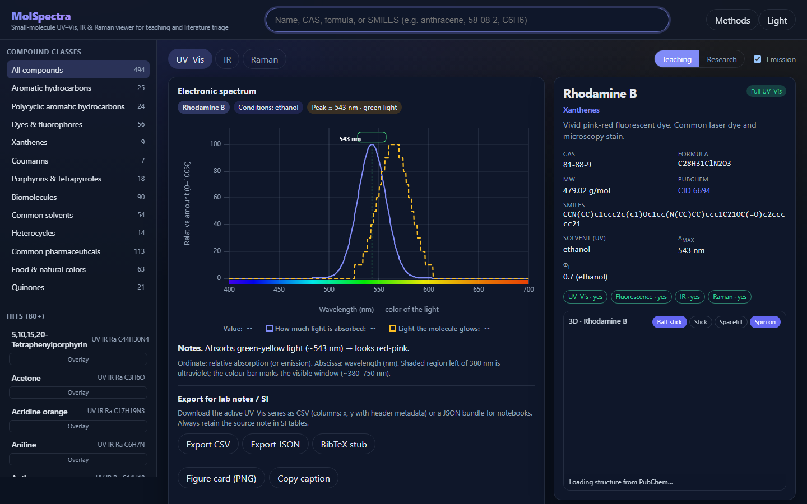
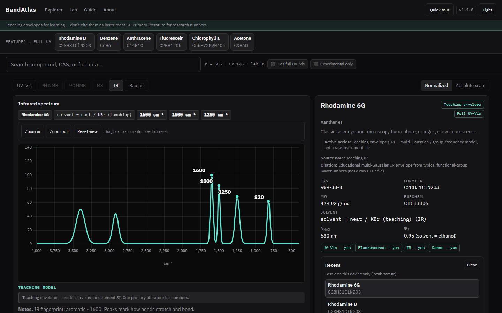
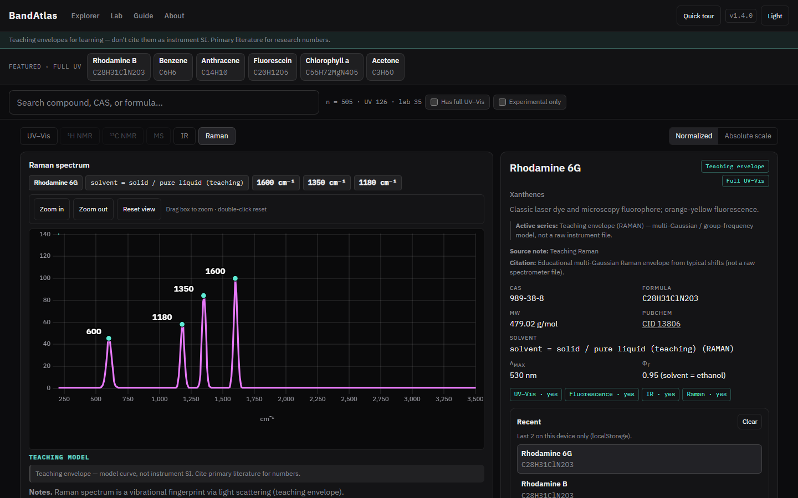
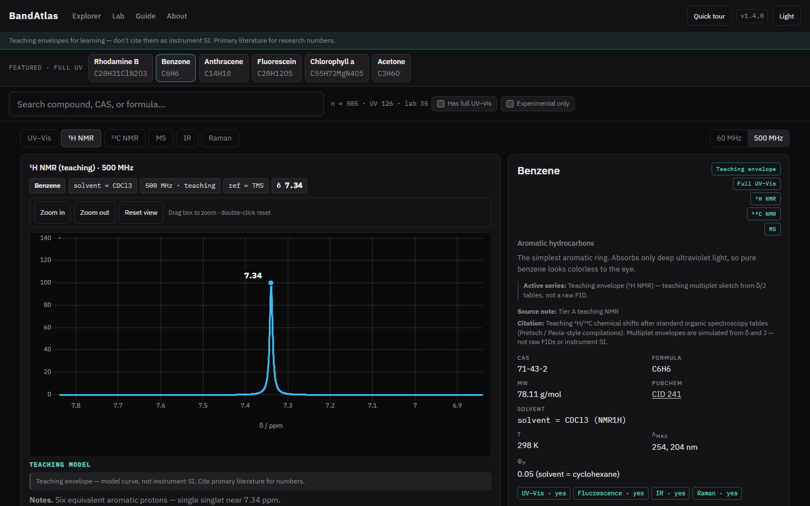
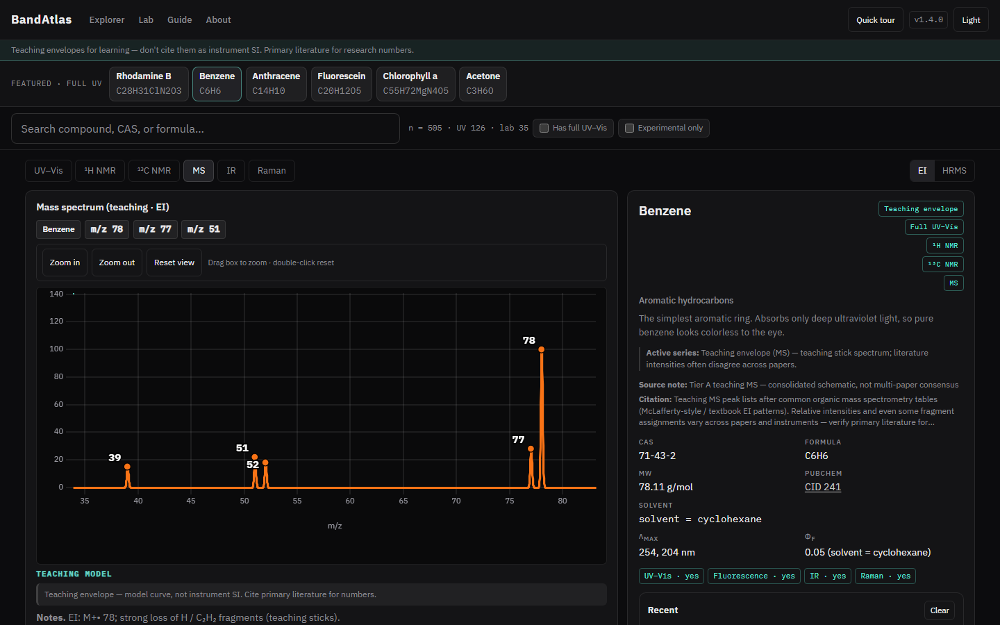
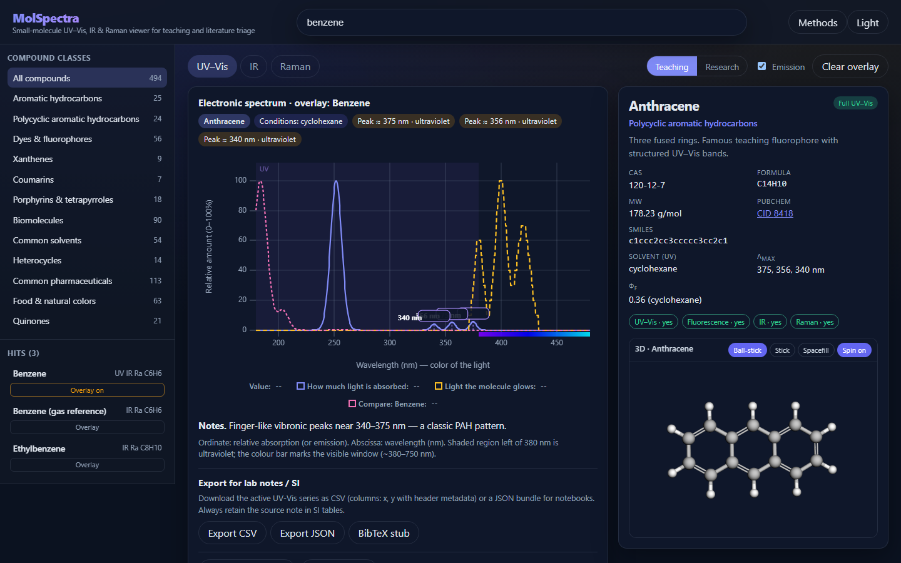
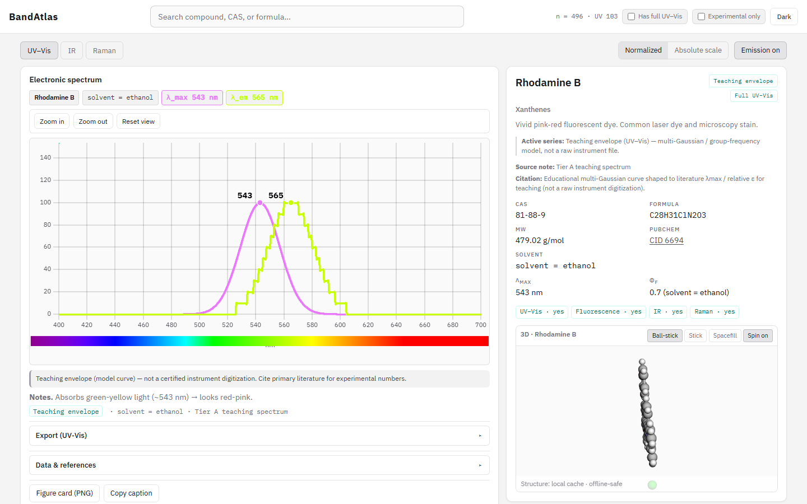
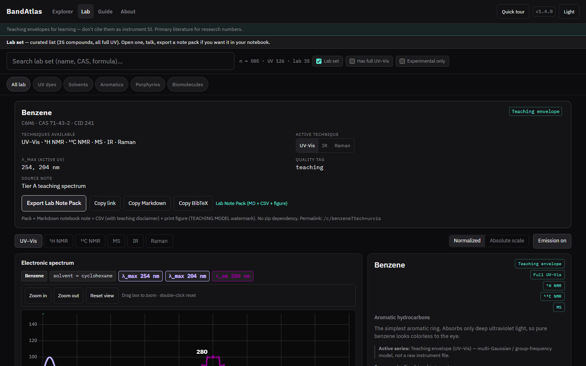

<div align="center">

# BandAtlas

**A browser atlas of small-molecule UV–Vis, IR, Raman, teaching ¹H/¹³C NMR, and MS bands.**

Structures via PubChem · quality tags on every curve · CSV/JSON export for lab notes

[](https://nikshaybisht.github.io/bandatlas/)
[](LICENSE)
[](https://github.com/nikshaybisht/bandatlas/actions/workflows/ci.yml)
[](CITATION.cff)

</div>

---



## What it is

A static React app for browsing ~505 small-molecule records. Search a compound, open UV–Vis / IR / Raman / teaching **¹H·¹³C NMR** / **MS**, overlay a second structure, and export a note pack for lab write-ups. There’s a curated **Lab** set (~35 full-UV compounds) and an optional quick tour on the explorer.

Most UV/IR/Raman curves are **teaching envelopes** — multi-Gaussian / group-frequency shapes pinned to literature λ_max or textbook cm⁻¹. NMR and MS pilots are teaching multiplet/stick schematics (literature values often disagree across papers). A few slots exist for real open experimental series (`data/experimental/`); that count is basically zero for now.

**Don’t cite teaching curves as instrument SI.** Use primary literature for research numbers. See [docs/methodology.md](docs/methodology.md).

PhotochemCAD-style layout ideas; not affiliated with PhotochemCAD.

## Screenshots

| UV–Vis + emission | IR |
|:---:|:---:|
|  |  |

| Raman | ¹H NMR (teaching) |
|:---:|:---:|
|  |  |

| MS (EI teaching) | Overlay / compare |
|:---:|:---:|
|  |  |

| Light theme | Lab / export |
|:---:|:---:|
|  |  |

Screenshots under `docs/images/` are refreshed with the project’s Playwright capture tool when the UI changes.

## Features

- **Search & browse** ~505 compounds by name, CAS, formula, or SMILES
- **Six techniques** — UV–Vis, IR, Raman, teaching **¹H / ¹³C NMR** (60 & 500 MHz), and **MS** (EI / ESI / HRMS / MALDI teaching sticks on the pilot set)
- **Overlay mode** — drop a second spectrum on the same axes for comparison
- **3D structures** via 3Dmol, with local SDF → PubChem fallback
- **Quality tags** on every curve, plus availability pills (full UV vs catalog-only)
- **Export** — CSV, JSON, and a formatted Lab Note Pack
- **Share** — figure PNG, markdown, BibTeX for a given compound
- **Lab companion set** — ~35 curated full-UV compounds for teaching
- **Offline structure cache** — committed SDFs for the lab set
- **Accessibility** — keyboard focus, 375px mobile layout, reduced-motion support

## Installation

### Requirements

- **Node.js 22+** (LTS recommended) and **npm** (ships with Node)
- Git
- Optional: Chromium for end-to-end tests (`npx playwright install chromium`)

### Install & run (development)

```bash
git clone https://github.com/nikshaybisht/bandatlas.git
cd bandatlas
npm ci
npm run dataset
npm run dev
```

Then open **http://127.0.0.1:5173** in your browser.

| Step | What it does |
|------|----------------|
| `npm ci` | Installs dependencies from `package-lock.json` (preferred over `npm install` for a clean tree) |
| `npm run dataset` | Builds compound JSON under `public/dataset/` from UV / NMR / MS seeds |
| `npm run dev` | Starts the Vite dev server with hot reload |

### Production build & preview

```bash
npm run build
npm run preview
```

- `build` — dataset + TypeScript check + Vite production bundle → `dist/`
- `preview` — serves `dist/` locally (default **http://127.0.0.1:4173**)

### Useful scripts

| Script | Purpose |
|--------|---------|
| `npm run ci` | Full check: lint, validate seeds, dataset, unit tests, typecheck, production build |
| `npm test` | Validate seeds + rebuild dataset + unit tests |
| `npm run test:e2e` | Playwright smoke (run `npm run build` first; install Chromium once if needed) |
| `npm run structures` | Refresh offline SDF cache for lab/featured compounds (needs network) |
| `npm run screenshots` | Capture README/guide images (dev or preview server must be running) |
| `npm run lint` | oxlint |

### Deploy notes

- **Live site:** https://nikshaybisht.github.io/bandatlas/
- GitHub Pages uses base path `/bandatlas/` (`VITE_BASE` / Pages workflow). Locally the base is `/`.
- Structure SDFs under `public/structures/` are committed so CI and offline demos work without PubChem.

## Dataset (rough)

Counts come from `public/dataset/summary.json` after a dataset rebuild:

- ~505 searchable compounds (identity + IR/Raman teaching models)
- ~126 full UV–Vis teaching envelopes (`data/uv-seeds/`)
- ~379 catalog-only for UV (searchable; no full UV curve yet)
- real open experimental series: **0** so far (schema path ready under `data/experimental/`)
- teaching NMR pilot: **15** compounds with ¹H + ¹³C peak lists (`data/nmr-seeds/`) — see [docs/NMR_PLAN.md](docs/NMR_PLAN.md)
- teaching MS pilot: **15** compounds (`data/ms-seeds/`) — see [docs/MS_PLAN.md](docs/MS_PLAN.md); literature intensities often disagree across papers

IR/Raman curves are group-frequency teaching models, not instrument SI.  
External databases & package strategy: [docs/DATA_SOURCES.md](docs/DATA_SOURCES.md).  
Add a UV teaching seed: [docs/ADD_SPECTRUM.md](docs/ADD_SPECTRUM.md). Course bits under `docs/course/` if useful.

## Docs

- [Methodology](docs/methodology.md) — how the teaching curves are built
- [Add a spectrum](docs/ADD_SPECTRUM.md) — contributor path for UV seeds
- [Course materials](docs/course/) — Top 50 worksheet + instructor notes
- [PWA status](docs/PWA.md) · [A11y / mobile checklist](docs/A11Y_MOBILE_CHECKLIST.md)
- [Data sources & packaging](docs/DATA_SOURCES.md) · [NMR plan](docs/NMR_PLAN.md) · [MS plan](docs/MS_PLAN.md)
- [Contributing](CONTRIBUTING.md) · [Security](SECURITY.md) · [Changelog](CHANGELOG.md)

## Cite

```
Bisht, N. (2026). BandAtlas (v1.4.1) [Computer software].
https://github.com/nikshaybisht/bandatlas
Live: https://nikshaybisht.github.io/bandatlas/
```

`CITATION.cff` is in the repo. Always cite the original spectral paper for experimental values.

## License

MIT — Nikshay Bisht ([@nikshaybisht](https://github.com/nikshaybisht))
